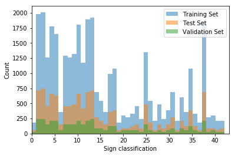
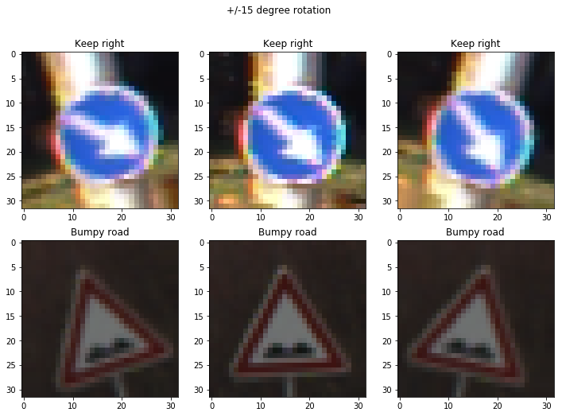
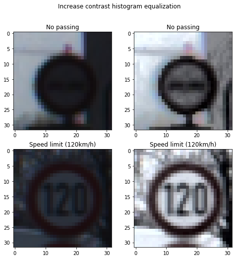
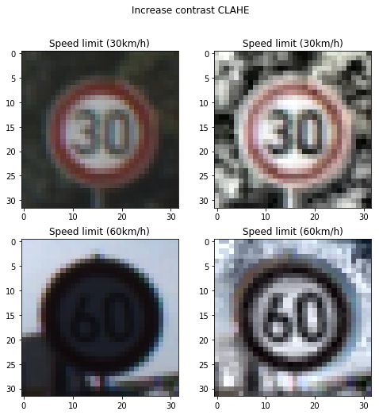
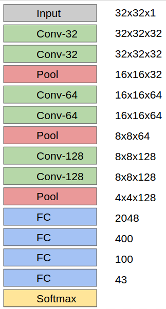
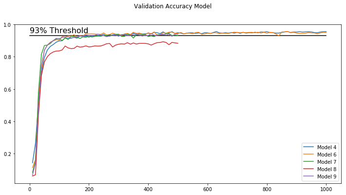

## Project: Build a Traffic Sign Recognition Program

---

The purpose of this project is to create a classifier for traffic signs. The model is trained and validated with the [German Traffic Sign Dataset](http://benchmark.ini.rub.de/?section=gtsrb&subsection=dataset).  The dataset contained 39,920 32x32 color images split amongst a training, validation, and test set. The dataset was not evenly distributed as shown in the histogram below.

## Augmentation

Four types of data augmentation were performed.
1. Rotation to adjust for seeing signs at angles. Additional steps to augment data not performed here would be to warp images. 

    

2. Histogram equalization to increase contrast 

    
3. Contrast limited histogram equalization to increase contrast with a larger kernel size 

    

## Preprocessing

Images were converted to grayscale and normalized

## Model Architecture

The model is based on VGG. It achieves an accuracy of 95% on the validation set.

## Train, Validate and Test the Model

An accuracy of 95% was achieved on the validation set (model 6)  More models were trained with fewer epochs to test ensemble learning. One model didn't achieve the 93% accuracy after 500 epochs.
1. Learning rate set to 1e-4. The learning rate of Adam decays over time and adjusts based on the gradient of the variables with momentum.
2. Adam Optimizer adjusts the learning rate using the [Adam algorithm](https://arxiv.org/pdf/1412.6980v8.pdf) This optimizer is derived from Adagrad an adaptive learning algorithm. The algorithm monotonically reduces its learning rate over time. RMSProp improved on this by using a moving average of gradients to reduce the aggressiveness of Adagrad. Adam improved on RMSProp by adding momentum. The default momentum and decay rate are used from tensorflow.
3. A batch size of 64 is a function of using a large VGG-like architecture and having an older GPU. The first LeNet-like architecture had a batch size of 512.
4. Dropout parameter of 0.5 is used as a default because it works [Srivastava et al 2014](https://www.cs.toronto.edu/~hinton/absps/JMLRdropout.pdf) supposedly because it maximizes the regularization value of the dropout layer.
5. Based on VGGNet
6. The number of epochs was set to 1000 originally. This is because it was a large number at which point it seemed like the loss had reached a plateau. When training multiple networks 500 was used because it took a long time and graphs of validation accuracy of the prior run had plateued around then.

Files
---
[Traffic_Sign_Classifier.ipynb](Traffic_Sign_Classifier.ipynb) contains the entirety of the project. This includes data exploration, augmentation, and preprocessing as well as model training, testing, and explanations.

